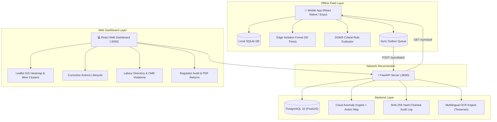

# Intellifusion SafeMine — Comprehensive Project Workflow Guide

> **Intellifusion SafeMine (SIH26024)**  
> **AI-Based Smart Governance & Compliance Monitoring System for Coal Mines**  
> *Under the statutory framework of Directorate General of Mines Safety (DGMS) & Coal Mines Regulations (CMR 2017)*

---

## Table of Contents
1. [Project Overview & Architecture](#1-project-overview--architecture)
2. [Prerequisites & System Requirements](#2-prerequisites--system-requirements)
3. [Quick-Start Runbook (Step-by-Step)](#3-quick-start-runbook-step-by-step)
4. [Demo Accounts & Role Access Matrix](#4-demo-accounts--role-access-matrix)
5. [Core Operational Workflows](#5-core-operational-workflows)
   - [Workflow A: Field Inspector Observation Logging & Risk Scoring](#workflow-a-field-inspector-observation-logging--risk-scoring)
   - [Workflow B: Inspection Management & Corrective Action Lifecycle](#workflow-b-inspection-management--corrective-action-lifecycle)
   - [Workflow C: Labour Attendance & Worker Master Directory](#workflow-c-labour-attendance--worker-master-directory)
   - [Workflow D: GIS Spatial Hazard Intelligence & Heatmaps](#workflow-d-gis-spatial-hazard-intelligence--heatmaps)
   - [Workflow E: DGMS Regulatory Audit & SHA-256 Chain Verification](#workflow-e-dgms-regulatory-audit--sha-256-chain-verification)
   - [Workflow F: Multilingual OCR Permit Ingestion & Review Queue](#workflow-f-multilingual-ocr-permit-ingestion--review-queue)
6. [Offline-First Sync Engine Mechanics](#6-offline-first-sync-engine-mechanics)
7. [Verification, Health Checks & Testing Commands](#7-verification-health-checks--testing-commands)
8. [Troubleshooting & Common Questions](#8-troubleshooting--common-questions)

---

## 1. Project Overview & Architecture

Intellifusion SafeMine solves the critical safety and compliance communication breakdown in underground and opencast coal mines. It addresses the lack of connectivity in deep galleries, delayed regulatory filings, unstandardized risk judgments, and contract labour compliance gaps.



### Core Architecture Pillars:
- **Offline-First Resilience**: Mobile works completely disconnected underground. Observations, manual scoring, photos, GPS/beacons, and attendances are saved to SQLite and queued in an outbox.
- **Dual AI & Manual Scoring**: Edge Isolation Forest (pure TypeScript) + statutory preset tiers with fine-grained numeric steppers (0.05–1.00 index).
- **Non-Bypassable DGMS Safety Floor**: Critical keywords (`roof collapse`, `fire`, `methane leak`, `inundation`, `haul failure`) automatically lock scores to `0.95 HIGH` (`dgms_override`), preventing human suppression.
- **Tamper-Evident SHA-256 Audit Ledger**: Every write (create, update, transition, sign-off) is cryptographically linked to the previous transaction hash.
- **CMR 2017 Labour Compliance**: Separated Worker Master directory with automated violation checks for maximum daily hours, overtime, and mandatory rest periods.

---

## 2. Prerequisites & System Requirements

Before running the project locally, ensure you have:

| Tool | Recommended Version | Purpose |
| :--- | :--- | :--- |
| **Node.js** | `>= 18.x` (LTS) | Dashboard & Mobile dependencies |
| **Python** | `>= 3.11` | Backend virtualenv / test execution |
| **Docker & Docker Compose** | Latest (v24+) | Database (`intellifusion_db`) & Backend container (`intellifusion_backend`) |
| **Git** | Latest | Version control |
| **Expo Go** (Optional) | Latest (iOS / Android) | Physical device mobile testing |

---

## 3. Quick-Start Runbook (Step-by-Step)

Follow these exact steps to launch the entire full-stack ecosystem:

### Step 1: Start Database & Backend API
In the project root directory (`c:\projects\SIH`):

```bash
# Start PostgreSQL database and FastAPI backend container
docker-compose up -d

# Verify containers are healthy
docker ps
```
- **Backend API**: [http://localhost:8000](http://localhost:8000)
- **Interactive Swagger Docs**: [http://localhost:8000/docs](http://localhost:8000/docs)
- **API Health Endpoint**: [http://localhost:8000/health](http://localhost:8000/health)

### Step 2: Database Migrations & Initial Seed
The database migrations and initial demo data are applied via Alembic and Python seed scripts:

```bash
# Apply all schema migrations (up to 012_add_risk_score_source)
docker exec intellifusion_backend alembic upgrade head

# Reset or seed complete demo scenario (mine sites, users, inspections, observations)
docker exec intellifusion_backend python scripts/reset_demo.py
```

### Step 3: Run the Web Dashboard
Open a terminal in `c:\projects\SIH\dashboard`:

```bash
cd dashboard
npm install
npm run dev
```
- **Web Dashboard URL**: [http://localhost:3000](http://localhost:3000)
- **Theme**: Executive Light Theme (`#FFFFFF` surfaces, slate-50 canvas, royal blue accents, vector icons).

### Step 4: Run the Mobile Application (Expo)
Open a terminal in `c:\projects\SIH\mobile`:

```bash
cd mobile
npm install
npx expo start
```
- Press `w` to open in browser (web preview).
- Press `a` for Android Emulator or scan QR code with **Expo Go** on a physical mobile device on the same local Wi-Fi.

---

## 4. Demo Accounts & Role Access Matrix

The platform enforces strict Role-Based Access Control (RBAC) across 5 distinct industry personas:

| Role | Email | Password | Allowed Access & Scope |
| :--- | :--- | :--- | :--- |
| **Field Inspector** | `inspector1@mine.in` | `password123` | Underground hazard logging, assigned inspections, field photo evidence capture, edge AI risk scoring. |
| **Mine Official (Manager)** | `official1@mine.in` | `password123` | Mine site command center, observation review, corrective action dispatch, contractor assignment, inspection scheduling, worker master management. |
| **Regulator (DGMS)** | `regulator@dgms.gov.in` | `password123` | Statutory safety audit, tamper-evident SHA-256 blockchain verification, monthly DGMS Form returns PDF export, national compliance oversight. |
| **Contractor** | `contractor1@mine.in` | `password123` | Assigned hazard remediation view, before/after rectification photo evidence submission, work completion logging. |
| **Corporate Manager** | `corporate1@mine.in` | `password123` | Multi-site executive safety KPIs, cross-mine benchmarking, environmental & production statutory thresholds. |

---

## 5. Core Operational Workflows

### Workflow A: Field Inspector Observation Logging & Risk Scoring
*Persona: Field Inspector (Mobile App or Web)*

```
[1. Identify Hazard] ➔ [2. Select Category & Description] ➔ [3. Choose Scoring Mode: Auto vs Manual]
                                                                        │
        ┌───────────────────────────────────────────────────────────────┴───────────────────────────────┐
        ▼                                                                                               ▼
   [Auto Mode (AI)]                                                                             [Manual Override]
   • 50-Tree Isolation Forest                                                                   • Select Tier: Low/Med/High/Crit
   • Real-time feature extraction                                                               • Calibrated score stepper (0.05-1.00)
                                                                                                • Mandatory justification reason
        │                                                                                               │
        └───────────────────────────────────────┬───────────────────────────────────────────────────────┘
                                                ▼
                             [DGMS Critical Safety Floor Check]
                             Keywords matched? (roof fall, gas leak, fire, etc.)
                                    ├── YES ➔ Force 0.95 HIGH ("dgms_override")
                                    └── NO  ➔ Persist selected mode
                                                ▼
                                    [Save to SQLite Local DB]
                                                ▼
                                    [Sync via Outbox when online]
```

1. Open Mobile App and navigate to **New Observation**.
2. Select Category (`Safety`, `Environment`, `Labour`, `Production`).
3. Enter description (e.g., *"Loose strata delamination observed on haulage cross-cut 2"*).
4. Attach evidence photo (or use simulated radar fallback) and pick GPS / Underground Beacon ID.
5. **Choose Scoring Mode**:
   - **Auto (AI Model)**: Evaluated instantly on-device via 50-tree Isolation Forest.
   - **Manual Override**: Tap **Manual Override**, select statutory risk tier (**Low 25%**, **Medium 50%**, **High 80%**, **Critical 95%**), adjust the calibrated score stepper, and fill in the mandatory **Override Justification** (e.g., *"Visual inspection shows 3 timber props deflected"*).
6. **Safety Floor Protection**: If the description mentions a critical hazard (e.g., *"roof collapse imminent"*), the system flags **DGMS Critical Safety Floor Triggered** and locks the score to `0.95 HIGH` (`dgms_override`).
7. Tap **Score & Save Offline** ➔ Instant **Risk Assessment Card** displays top drivers and offline queue status.

---

### Workflow B: Inspection Management & Corrective Action Lifecycle
*Personas: Mine Official ➔ Field Inspector ➔ Contractor ➔ Mine Official*

1. **Schedule Inspection**:
   - Mine Official visits **Inspections** on the dashboard and schedules an inspection for a mine zone (e.g., *Gallery 4 East*), assigning `inspector1@mine.in`.
2. **Execute Inspection**:
   - Field Inspector logs in on Mobile, opens assigned inspection, marks it **In Progress**, logs statutory observations, and clicks **Submit Inspection Report**.
3. **Trigger Corrective Action**:
   - High-risk hazards automatically generate a linked **Corrective Action** (or the Mine Official clicks **Create Action** from the Risk Card Modal).
4. **Assign Contractor**:
   - Mine Official assigns `contractor1@mine.in` with a statutory remediation deadline (e.g., 24 hours under CMR Regulation 104).
5. **Remediation & Closure**:
   - Contractor logs in, views assigned corrective action, uploads rectification after-photo evidence, and marks **Work Complete**.
   - Mine Official reviews evidence in the **Action Lifecycle Kanban** and signs off on closure.

---

### Workflow C: Labour Attendance & Worker Master Directory
*Personas: Mine Official & Contractor*

1. **Worker Master Directory** (`/workers`):
   - Workers are registered **ONCE** with permanent identity details: Full Name, Badge Number, Trade/Role (e.g., *Drill Operator*, *Roof Bolter*), Assigned Contractor, and Mine Site.
   - Eliminates repetitive daily identity re-typing.
2. **Daily Shift Attendance**:
   - At the shift gate, official selects date, shift (*Morning / Afternoon / Night*), picks worker from master dropdown, and enters `in_time` and `out_time`.
3. **Automated CMR 2017 Violation Engine**:
   - **Shift Length Violation**: Exceeds 8 statutory daily hours (CMR Reg 152).
   - **Overtime Breach**: Weekly work exceeding 48 hours.
   - **Mandatory Rest Period**: Less than 16 hours of rest between consecutive shifts.
   - Violations immediately highlight in red with statutory penalty tags and feed into the monthly compliance return.

---

### Workflow D: GIS Spatial Hazard Intelligence & Heatmaps
*Personas: Mine Official, Corporate Manager, Regulator*

1. Navigate to **Mine Map** (`/map`) on the Web Dashboard.
2. **Basemap Selection**: Switch between high-resolution Satellite Imagery and OpenStreetMap topology in Executive Light Theme.
3. **Hazard Density Heatmap Layer**:
   - Toggle **Hazard Density Heatmap** to visualize thermal risk concentration across mine sectors based on geo-coordinates and risk severity weighting.
4. **Spatial Pin Clustering**:
   - Zoom out to view cluster bubbles grouping nearby hazards; click any pin to open the observation summary, telemetry, and quick-link to the full Risk Card.
5. **Geofenced Underground Sectors**:
   - View boundary polygons for high-risk extraction panels and underground beacon corridors.

---

### Workflow E: DGMS Regulatory Audit & SHA-256 Chain Verification
*Persona: DGMS Regulator (`regulator@dgms.gov.in`)*

1. Navigate to **Audit Ledger** (`/audit`) on the Dashboard.
2. **Cryptographic Verification**:
   - Click **Verify Blockchain Integrity**. The system iterates through every transaction block, recalculates the SHA-256 hash using `previous_hash + actor_id + action + timestamp + payload`, and confirms the chain is mathematically unbroken (`TAMPER_FREE`).
3. **Risk Scoring Provenance Inspection**:
   - Review observations to immediately distinguish **AI Auto-Scored**, **Manual Inspector Overrides**, and **DGMS Rule Overrides**.
   - Hover over any **Manual** pill tag to read the inspector's statutory override justification.
4. **Export Statutory DGMS Monthly Returns**:
   - Navigate to **Reports** and generate official DGMS monthly safety returns formatted as printable, statutory-compliant PDFs.

---

### Workflow F: Multilingual OCR Permit Ingestion & Review Queue
*Persona: Mine Safety Clerk / Official*

1. Navigate to **Permits & OCR** (`/permits`) on the Dashboard.
2. Upload a scanned safety permit, blast notification, or gas log sheet (English or Hindi).
3. Tesseract OCR extracts text, detects gas concentrations (% CH4, CO ppm), dates, and signatures.
4. If OCR extraction confidence is `< 70%`, it is automatically placed in the **Human-in-the-Loop Review Queue** for manual approval before entering the primary compliance ledger.

---

## 6. Offline-First Sync Engine Mechanics

The offline synchronization operates on an append-only store-and-forward principle:

```
[Mobile Action]
       │
       ▼
Insert into SQLite table: local_observations
Insert into SQLite table: outbox_queue (endpoint, payload, attempts=0)
       │
       ▼ (Network Monitor: NetInfo detects Internet connection)
Trigger outboxSyncWorker()
       │
       ▼
HTTP POST /sync/batch
   └── Request body: { observations: [ ... ] }
       │
       ├── Backend enforces apply_dgms_safety_floor()
       ├── Backend enriches with Cloud Isolation Forest
       ├── Backend appends audit ledger entry
       └── Responds 201 Created: { synced_count: N, created_ids: [ ... ] }
       │
       ▼
Mobile marks outbox item as SYNCED (or removes on confirmation)
Updates local_observations set synced_at = now()
```

---

## 7. Verification, Health Checks & Testing Commands

To run automated health checks and verification scripts across the stack:

### 1. Type-Checking (Zero TypeScript Errors)
```bash
# Verify Mobile TypeScript
cd mobile
npx tsc --noEmit

# Verify Dashboard TypeScript & Production Bundle
cd ../dashboard
npm run build
```

### 2. Manual Risk Score & DGMS Floor E2E Test
```bash
# Runs full test: Auto mode, Manual mode with reason, DGMS keyword override, and Batch Sync
docker exec intellifusion_backend python scripts/verify_manual_risk_score.py
```

### 3. Labour Compliance & Worker Directory Test
```bash
# Verifies Worker Master creation, attendance linking, and RBAC 403 enforcement
docker exec intellifusion_backend python scripts/verify_labour_worker_flow.py
```

### 4. Cryptographic Audit Chain Verification
```bash
# Verifies SHA-256 chain continuity and detects intentional tampering
docker exec intellifusion_backend python scripts/verify_audit_chain.py
```

---

## 8. Troubleshooting & Common Questions

#### Q: How do I access the dashboard from another device on the local network?
Run `npm run dev -- --host` in `dashboard/`. Access via your computer's local IP address (e.g., `http://192.168.1.50:3000`).

#### Q: What if Docker reports port 8000 or 5432 already in use?
Check if local Postgres or Python is running on Windows:
```powershell
netstat -ano | findstr ":8000"
netstat -ano | findstr ":5432"
# Kill process if necessary: taskkill /PID <PID> /F
```

#### Q: How to reset the entire database to a clean demo state?
```bash
docker exec intellifusion_backend alembic upgrade head
docker exec intellifusion_backend python scripts/reset_demo.py
```

#### Q: Where are uploaded photo files stored?
In local development, photos are stored in `backend/app/static/uploads/` and served statically via `http://localhost:8000/static/uploads/`.
